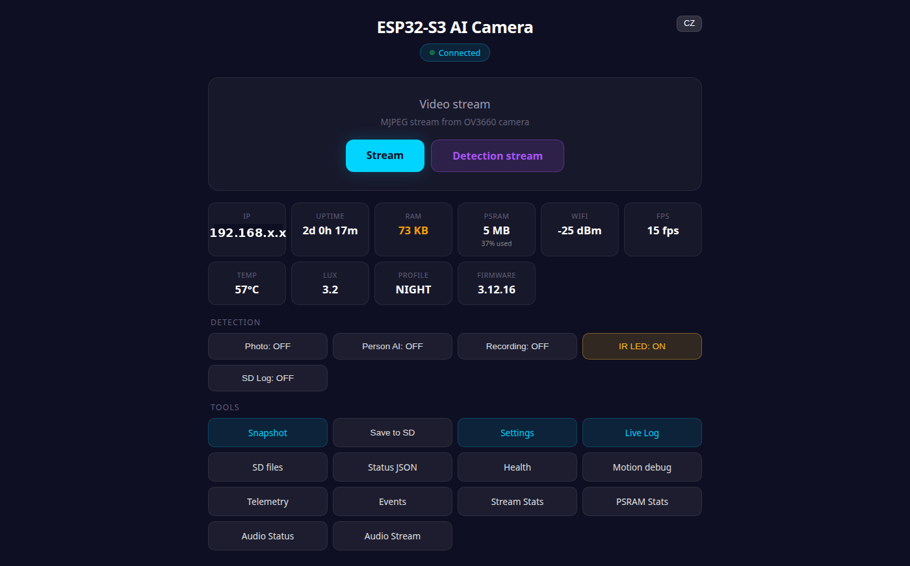
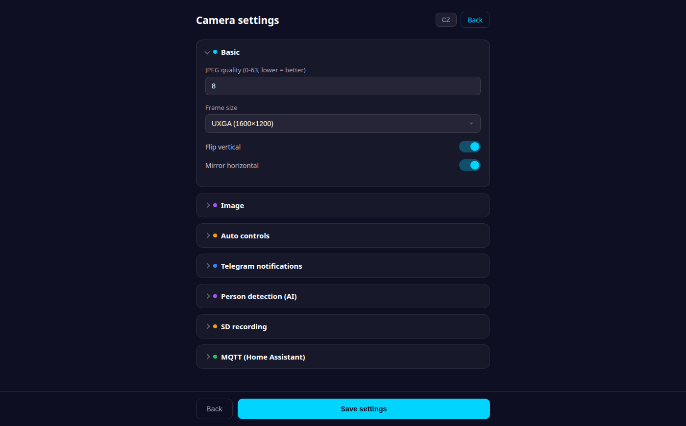

# :movie_camera: DFR1154 AI Camera Firmware :shield:

[](https://www.dfrobot.com/product-2730.html)
[](https://platformio.org/)
[](https://www.espressif.com/)
[](https://www.python.org/)
[](LICENSE)
[]()
[]()

Firmware for the **DFRobot DFR1154 AI Camera Module** (FireBeetle 2 ESP32-S3 + OV3660 3 MP + LTR-308 lux + PDM mic). A lock-free PSRAM ring buffer feeds MJPEG streaming, RTSP, AVI recording, on-device person detection (Edge Impulse FOMO + ByteTrack) concurrently from a single camera. MQTT auto-discovery for Home Assistant, Telegram bot, time-lapse, web dashboard with live log. No cloud required.

The optional `a12_system/` Python companion is part of **A12**, a multi-camera surveillance system that pairs with this firmware (and future ESP-camera modules) for YOLOv11n inference, face recognition, and sensor fusion with Home Assistant / Zigbee.

> [!TIP]
> **New in v3.12.48** — **Restart-rate detection** (boot-timestamp ring buffer; `/health` exposes `restarts_1h`/`restarts_24h` + self-clearing, POWERON-aware `power_health`), **mDNS hostname resolver** (reach the camera by name, not a drifting DHCP IP), **stream reader split** into drain + decode threads (no more send-buffer stalls), and a new [data-privacy guide](docs/DATA_PRIVACY.md). See [CHANGELOG](CHANGELOG.md).
>
> *v3.12.44* — A12 Groq vision face recognition (LLaMA 4 Scout) and automatic Nuki Smart Lock unlock for recognized residents. *v3.12.43* — Settings GUI exposes `person_telegram_photo` toggle and idle scan interval. *v3.12.42* — `PD_MIN_DETECTIONS` 2→1, `IDLE_SCAN_MS` 30s→5s, A12 MQTT `clean_session=True` fix. *v3.12.41* — TFLite Micro + ESP-NN SIMD: ~300–500 ms inference (11× speedup). *v3.12.39* — UNCERTAIN detections routed via MQTT to A12 for YOLO verification.
>
> *v3.12.34* — Telegram TLS reuse. *v3.12.32* — Telegram boot hang fix. *v3.12.17* — A12: exponential backoff, recovery snapshot.

---

## Two Deployment Modes

| | **Standalone** | **Enhanced (A12 mode)** |
|---|---|---|
| Hardware | ESP32 only | ESP32 + server / Raspberry Pi |
| Person detection | FOMO on-device (~300–500 ms) | FOMO gates YOLOv11n via A12 (server-side) |
| UNCERTAIN detections | Direct Telegram (low-confidence caption) | MQTT → A12 YOLO verify → Telegram only if confirmed |
| Face recognition | No | Yes — Groq vision (LLaMA 4 Scout, free API) |
| Auto door unlock | No | Yes — Nuki via Home Assistant on high-confidence match |
| Telegram alerts | Yes — sent by ESP32 | Yes — sent by A12 (with face ID + AV clip) |
| AV clips | No | Yes — MP4 with audio |
| Home Assistant | MQTT (direct) | MQTT (direct + A12 enrichment) |
| `INCLUDE_TELEGRAM` | **On** | **Off** (saves 45 KB heap for SSL) |
| `INCLUDE_AUDIO` | Optional | **On** (A12 uses audio:82 for clips) |
| Setup time | ~15 min (flash + configure) | ~30 min (flash + Docker + enroll faces) |

Use **Standalone** when the camera operates independently (remote location, no local server).
Use **Enhanced** for a fixed installation with a server/Pi running 24/7 — UNCERTAIN detections are verified by YOLOv11n before any alert fires.

---

## Table of Contents

- [In 3 Points](#in-3-points)
- [Who Is This For](#who-is-this-for)
- [What You Need](#what-you-need)
- [Quick Start](#quick-start) (~15 min)
- [A12 Companion](docs/A12_COMPANION.md)
- [Public Release Scan](docs/PUBLIC_RELEASE_SCAN.md)
- [How It Works](#how-it-works)
- [Detection Pipeline](#detection-pipeline)
- [Features](#features)
- [Web Dashboard](#web-dashboard)
- [Telegram Bot](#telegram-bot)
- [API Reference](#api-reference)
- [System Architecture](#system-architecture)
- [Camera & Sensor Quirks](#camera--sensor-quirks)
- [Configuration](#configuration)
- [Compile-Time Feature Toggles](#compile-time-feature-toggles)
- [Known Issues & Limitations](#known-issues--limitations)
- [Troubleshooting](#troubleshooting)
- [Roadmap](#roadmap)
- [FAQ](#faq)
- [Real-World Deployment](#real-world-deployment)
- [Security & Privacy](#security--privacy)
- [Development History](#development-history)
- [Acknowledgments](#acknowledgments)
- [License](#license)

---

## In 3 Points

1. **Three concurrent video pipelines from one ESP32-S3.** A lock-free CAS-based ring buffer (3 × 256 KB PSRAM slots) feeds MJPEG streaming, RTSP server, AVI recording, motion detection, FOMO inference, time-lapse, and dashboard snapshots — all simultaneously, **without frame copies**, from a single `captureTask`. The ring buffer protocol uses atomic CAS reference counting (`-1` writer / `0` free / `>0` readers).
2. **Three-state on-device detection cascade.** Block-based motion detection (~10 ms at 400×300 grayscale) gates Edge Impulse FOMO inference (~300–500 ms at 64×64 int8, TFLite Micro + ESP-NN) — temporal-filtered for **~90% false-positive reduction** and tracked by a lightweight ByteTrack-style Kalman tracker. Output is **NONE / UNCERTAIN / CONFIDENT**: confident hits send Telegram directly; uncertain hits (60–75%) route via MQTT to A12 for YOLOv11n verification — no false alarms, no silent drops.
3. **Battle-tested production firmware.** 6+ months of continuous operation, 50+ versions, full Home Assistant MQTT discovery, Telegram bot with 10 commands, OTA updates with auto-rollback, captive portal AP fallback, NVS-encrypted credentials, sabotage detection watchdog, day/night/dusk auto-profiles via LTR-308 lux sensor.

---

## Who Is This For

- **DIY home security users** who want a **self-hosted** AI camera without cloud subscriptions or recurring fees
- **Home Assistant users** looking for a camera that integrates natively via MQTT auto-discovery — motion, person, IR LED, lux, audio — all auto-created
- **Edge AI tinkerers** experimenting with FOMO, lightweight CNN inference, and on-device computer vision on microcontrollers
- **Embedded developers** studying lock-free ring buffers, FreeRTOS task design, ESP32-S3 PSRAM patterns, multi-server HTTP architectures, and SCCB I2C contention workarounds
- **Telegram users** who want photo + AVI video alerts directly to a chat with cooldown, active hours, and command-line control

---

## What You Need

### Hardware

| Part | Description | ~Cost |
|------|-------------|-------|
| **DFRobot FireBeetle 2 ESP32-S3** (DFR1154) | ESP32-S3 + OV3660 3 MP sensor + LTR-308 lux + PDM mic | $35 |
| MicroSD card | Class 10 or U1+, ≥ 8 GB (FAT32) — for AVI recording + time-lapse | $5 |
| 5 V power supply | **1 A or higher** — IR LED + WiFi + sensor can spike to 600 mA | $5 |
| **Total** | | **~$45** |

**Optional:**
- External IR illuminator for night vision range > 5 m
- Weatherproof enclosure (IP65) for outdoor deployment
- USB-C cable with data lines for OTA upload via USB

### Software (All Free)

- [PlatformIO](https://platformio.org/) — VS Code extension or CLI for build/flash/OTA
- [Home Assistant](https://www.home-assistant.io/) — optional, for MQTT auto-discovery
- [Mosquitto MQTT](https://mosquitto.org/) — optional broker (or any other MQTT broker)
- [Telegram](https://telegram.org/) — optional, for mobile alerts via bot
- Python 3.10+ — only if running the optional A12 server-side YOLOv11 cascade

### Required Skills

- Basic familiarity with Arduino / PlatformIO (medium difficulty)
- WiFi network setup and routing knowledge (easy)
- USB flashing or OTA upload (easy)
- **No machine learning knowledge required** — model is pre-trained
- Optional: HA MQTT integration setup if you want to use HA

---

## Quick Start

> [!TIP]
> **New to ESP32 flashing?** Follow the step-by-step guide in [`docs/FIRST_FLASH.md`](docs/FIRST_FLASH.md) — it covers PlatformIO install, port detection, boot-mode tricks, OTA updates, and common error fixes.

**~15 minutes from clone to a working camera.**

```bash
# 1. Clone
git clone https://github.com/PeterkoCZ91/DFR1154-ai-camera.git
cd DFR1154-ai-camera

# 2. Build firmware (uses default safe credentials — set your own later via web GUI)
cd firmware
~/.platformio/penv/bin/pio run --target upload

# 3. Monitor serial — find your IP address
~/.platformio/penv/bin/pio device monitor

# 4. Open the dashboard in a browser
# http://<device-ip>/         (main UI)
# http://<device-ip>/log-viewer  (live log with auto-refresh)
```

### Option B — Flash Pre-built Binary (no compiler needed)

Download the latest binaries from [GitHub Releases](../../releases/latest) and flash with esptool:

```bash
pip install esptool

esptool.py --chip esp32s3 --port /dev/ttyUSB0 --baud 460800 write_flash \
  0x0000  bootloader.bin \
  0x8000  partitions.bin \
  0x10000 firmware.bin
```

> **Windows:** replace `/dev/ttyUSB0` with `COM3` (check Device Manager → Ports).
> **macOS:** use `/dev/cu.usbserial-*` or `/dev/cu.SLAB_USBtoUART`.

On first boot the camera starts a WiFi AP **DFR1154-Camera** (password: `12345678`). Connect to it and open `http://192.168.4.1` to configure your WiFi credentials.

### First Boot

After flashing, the device tries:

1. **WiFi credentials from NVS** (if previously configured)
2. **Hardcoded defaults** — empty WiFi credentials, device immediately falls through to AP mode
3. **AP mode fallback** if both fail:
   - **AP name:** `ESP32-Camera-Setup`
   - **AP password:** `12345678`
   - Connect from your phone — captive portal opens automatically
   - Enter your WiFi credentials, click Save, device reboots

Once connected, open the **web dashboard** at `http://<device-ip>/`. HTTP Basic Auth is **on by default** (`LAB_MODE false` in `config.h`) — the first boot uses the default `admin / admin` credentials with AP password `12345678`. **Change these immediately via `/credentials` before exposing the device to an untrusted network.** To rebuild with auth bypassed for bench testing, pass `-DLAB_MODE=1` to PlatformIO.

> [!NOTE]
> **Don't know your IP?** Watch the serial monitor for `Local IP: http://192.168.x.x`. The device also advertises mDNS as `ESP32-Camera.local` if your network supports it.

### First Configuration (Web Dashboard)

1. Open `http://<device-ip>/` — the main dashboard
2. Click **Settings** — adjust brightness, JPEG quality, motion sensitivity
3. Enable **Photo: ON** to send Telegram photos on motion (requires Telegram token in `/credentials`)
4. Enable **Person AI: ON** to enable the FOMO person detection cascade
5. Open **Live Log** to watch real-time events as you trigger motion in front of the camera

### Optional: A12 Companion (Enhanced mode)

`a12_system/` adds server-side YOLO verification, Groq vision face recognition, AV clip
recording, Nuki auto-unlock, daily summaries, and shared-scorer support for multi-camera
setups. It is optional: the firmware works standalone, and Enhanced mode can be enabled
later without changing the firmware architecture.

```bash
a12_system/tools/setup.sh
a12_system/tools/a12 doctor
a12_system/tools/a12 build
a12_system/tools/a12 up
a12_system/tools/a12 logs 80
```

For the full A12 runtime guide, shared scorer contract, face-recognition flow and CLI
commands, see [`docs/A12_COMPANION.md`](docs/A12_COMPANION.md). For Docker deployment and
multiple camera instances, see [`a12_system/DOCKER.md`](a12_system/DOCKER.md).

> [!NOTE]
> When using A12, disable ESP32 Telegram to avoid duplicate alerts and free heap: comment
> out `#define INCLUDE_TELEGRAM` in `firmware/config.h` before flashing. See
> [Two Deployment Modes](#two-deployment-modes).

> [!IMPORTANT]
> **Public repository hygiene:** keep runtime config and private deployment data out of
> git. Do not commit `.env`, `config.env`, Telegram tokens, MQTT credentials, Home
> Assistant tokens, Wi-Fi credentials, logs, databases, face encodings, private
> screenshots, or model weights. Use placeholders such as `<camera-ip>` in issues and
> documentation. See [SECURITY.md](SECURITY.md), [SUPPORT.md](SUPPORT.md), and
> [`docs/DATA_PRIVACY.md`](docs/DATA_PRIVACY.md).

---

## How It Works

The OV3660 sensor captures JPEG frames into a single FreeRTOS `captureTask` running on Core 1. Frames land in a **lock-free 3-slot ring buffer in PSRAM** using atomic CAS reference counting — no copies, no mutex contention. Multiple consumer tasks read frames concurrently:

```
   OV3660 Sensor (~30 FPS UXGA)
        |
        v
  +------------+      +-------------------+
  | captureTask|----->|  Ring Buffer      |
  | (Core 1,   |      |  3 x 256 KB PSRAM |
  |  prio 10)  |      |  CAS atomic refs  |
  +------------+      +---------+---------+
                                |
       +------------------------+----------------------+
       |              |              |             |
       v              v              v             v
  +---------+   +----------+   +----------+   +---------+
  | MJPEG   |   | motion   |   | recording|   |timelapse|
  | streams |   | detector |   | task     |   | task    |
  | (port81)|   |   |      |   |          |   |         |
  +----+----+   |   v      |   +----+-----+   +----+----+
       |        |  FOMO    |        |              |
       v        | person   |        v              v
   Web client   | detector |    AVI on SD     JPEG on SD
                |   |      |    /YYYYMMDD/    /YYYYMMDD/
                |   v      |
                | tracker  |
                +----+-----+
                     |
              PersonDecision
             /      |      \
          NONE  UNCERTAIN  CONFIDENT
         (drop)    |           |
                   v           v
            [MQTT broker?]  Telegram
            Yes |   No |    MQTT/HA
                v       v
           A12 YOLO   Telegram
          (verify)   (direct)
                |
             Person?
            Yes |
                v
         Groq vision
        (LLaMA 4 Scout)
       /       |        \
    >=90%   65-89%      <65%
      |        |          |
      v        v          v
   Nuki    Telegram    Telegram
  unlock   (+ name     (unknown
 skip TG    hint)       alert)
```

### Ring Buffer Protocol (CAS-Based)

```
  ref_count semantics:
   -1 = writer (captureTask) is writing to this slot
    0 = slot is free
   >0 = number of active readers

  Writer (captureTask):
    1. CAS slot[i].ref_count from 0 to -1 (try to claim)
    2. memcpy frame data
    3. Memory barrier (__sync_synchronize)
    4. Update current_frame_index = i
    5. CAS slot[i].ref_count from -1 to 0 (release)

  Reader (any consumer task):
    1. idx = current_frame_index (with barrier)
    2. CAS slot[idx].ref_count from N to N+1 (increment)
    3. Read frame data
    4. Atomic decrement slot[idx].ref_count
```

The protocol guarantees:
- No reader blocks the writer
- No writer blocks readers
- Multiple readers can access the same frame simultaneously
- Old frames are not freed until all readers release them

---

## Detection Pipeline

Two-stage cascade with temporal filtering and persistent tracking:

```
  Frame ----> [Motion: 400x300 grayscale, EMA bg model, 4x4 blocks]
                |
                |  motion confirmed (2+ frames, clustered)
                v
              [FOMO: 64x64 int8, ~300-500ms (TFLite Micro + ESP-NN)]
                |
                |  raw detections (centroids)
                v
              [Tracker: ByteTrack-style Kalman, persistent IDs]
                |
                |  confirmed track + confidence score
                v
         [PersonDecision: three-state]
                |
         +------+-------+----------+
         |              |          |
         v              v          v
       NONE         UNCERTAIN   CONFIDENT
     (discard)      (60-75%)    (>=75%)
                       |          |
                       v          v
              [MQTT broker?]   Telegram
              Yes |   No |     + MQTT/HA
                  v       v
             A12 YOLO  Telegram
            (verify)  (direct)
                  |
                  v
              Telegram
             (if YOLO OK)
```

### What Alert Will I Receive?

The three-state output determines what happens for each detection — depends on confidence and whether A12 is connected:

| Result | Confidence | Standalone mode | A12 mode (MQTT connected) |
|--------|-----------|-----------------|--------------------------|
| **NONE** | < 60% | Nothing | Nothing |
| **UNCERTAIN** | 60–75% | Telegram photo (low-confidence caption) | MQTT → A12 YOLO verify → Telegram only if YOLO confirms |
| **CONFIDENT** | ≥ 75% | Telegram photo + HA/MQTT event | Telegram photo + HA/MQTT event |

**In practice:**
- A single glance of a person at the edge of frame → typically UNCERTAIN → in standalone you still get a Telegram photo; with A12 the YOLO check filters it out if there's really no person
- A person standing in front of the camera → CONFIDENT → immediate Telegram
- A shadow, animal, or lamp swing → NONE → nothing sent

The `person_confidence_threshold` (default 0.6) sets the NONE floor. The `person_confident_threshold` (compile-time, 0.75) sets the CONFIDENT floor. Everything between is UNCERTAIN.

### Motion Detection (motion_detection.cpp)

Block-based frame differencing against an EMA background model. The whole pipeline runs in ~10 ms at 400×300 working resolution.

| Parameter | Value | Purpose |
|-----------|-------|---------|
| **Working resolution** | 400×300 (UXGA / 4) | 4× more detail than v3.10 (was 200×150) |
| Block size | 4 × 4 pixels | Natural low-pass filter — single noisy pixel = 1/16 of block |
| Pixel diff threshold | 20 + AGC gain | Adaptive to sensor noise (gain 0 → 20, gain 30 → 50) |
| Pixel threshold (night) | × 2.5 | Boosted at night to filter sensor noise |
| Trigger percentage | 5% | Min blocks changed to trigger |
| Trigger pct (night) | × 2.5 | Stricter at night |
| Upper bound | 70% | Above = global light change, rejected |
| Confirm frames | 2 | Consecutive frames required |
| EMA alpha (day) | 0.92 | Background adaptation rate |
| EMA alpha (night) | 0.97 | Slower at night to suppress sensor noise |
| Cluster requirement | 1+ neighbor (day), 2+ (night) | 4-connected adjacency |
| Brightness reset | Δ > 80/255 between frames | Background reset on sudden light change |
| ROI mask | Per-block on/off | Configurable via `/roi-mask` API |

**Night mode** (avg brightness < 10): instead of blanket suppress, the detector requires stricter clustering and higher pixel thresholds — actual night motion is detected while sensor noise is filtered.

**Sudden light change**: when average brightness jumps by more than 80/255 between consecutive frames (e.g. lights turned on, sunset, headlights), the EMA background is instantly reset to the current frame to prevent false motion during the transition.

### Person Detection (person_detection.cpp)

Edge Impulse FOMO model running on the ring buffer's latest JPEG frame:

| Parameter | Value | Notes |
|-----------|-------|-------|
| Model | Edge Impulse FOMO | int8 quantized CNN |
| Input resolution | 64 × 64 grayscale | Fixed by FOMO architecture |
| Decode scale | JPG_SCALE_4X | UXGA → 400 × 300 → bilinear → 64 × 64 |
| Tensor arena | 140 KB PSRAM | |
| Min detections | 2 centroids | Spatial filter (single = noise) |
| **Temporal filter** | **2 consecutive frames** | Eliminates ~90% false positives |
| Histogram normalization | 1%-99% percentile stretch | Skipped if range < 20 (true night) |
| Inference time | ~300–500 ms | TFLite Micro + ESP-NN SIMD (resolved in v3.12.41) |

### Object Tracker (tracker.cpp)

Lightweight ByteTrack-style tracker with constant-velocity prediction and greedy matching:

| Feature | Value | Notes |
|---------|-------|-------|
| Max tracks | 16 simultaneous | Static SRAM allocation (~1 KB) |
| Track lifecycle | TENTATIVE → CONFIRMED → LOST → DELETED | |
| Min hits to confirm | 2 | Tentative tracks promoted after 2 successful matches |
| Max age | 30 frames | Lost tracks deleted after 30 frames without re-match |
| Max distance | 80 pixels | Greedy nearest-neighbor matching radius |
| Velocity smoothing | α = 0.7 (old) + 0.3 (new) | Exponential moving average |
| Per-frame cost | ~2-5 ms | |
| **Persistent IDs** | Yes | Same person stays same track ID until they leave |
| **Notification dedup** | Yes | `notified` flag prevents duplicate Telegram for same track |

The tracker is the answer to the v3.10.5 "person detection re-check photo spam" problem — same person now triggers a notification once, and only fires again when a new track is created.

### Camera Profiles (ir_handler.cpp)

Auto-switching between three camera tunings based on ambient light from the LTR-308 sensor:

| Profile | Lux range | Brightness | AE level | Gain ceiling | LENC | Use case |
|---------|-----------|------------|----------|--------------|------|----------|
| **DAY** | > 250 | 0 | 0 | 16× | ON | Daylight, bright indoor |
| **DUSK** | 5–250 | +3 | +5 | 128× | ON | Twilight, dim indoor |
| **NIGHT** | < 5 | +3 | +5 | 128× | OFF | Pure dark, IR LED active |

**LTR-308 sensor:** 100 ms integration time / 100 ms sample rate (was 500 ms in v3.10), giving 5× faster reaction to sunset, headlights, room lights. Lux is read every 100 ms via the shared I2C bus from `captureTask` (after frame return) to avoid SCCB contention with the camera driver.

**OV3660 ISP tuning** (init-time, SCCB-safe):
- LENC (lens correction) — corrects vignetting at corners
- BPC + WPC auto-adaptation — masks defective pixels
- SDE (Special Digital Effects) — contrast, saturation, brightness pipeline
- 2D Noise Reduction — UV chroma denoise

---

## Features

### :movie_camera: Streaming & Capture

| Feature | Description |
|---------|-------------|
| **MJPEG streaming** | Concurrent streams on port 81: `/stream` (raw), `/detection-stream` (with motion overlay) |
| **RTSP server** | Standard RTSP on port 554 (`rtsp://device:554/mjpeg/1`) for VLC, Frigate, Synology Surveillance Station, BlueIris |
| **Single-frame snapshot** | `/frame` returns latest JPEG from the ring buffer (no camera re-capture) — fast (~5 ms) |
| **AVI recording** | MJPEG video + PCM audio interleaved (RIFF/AVI 1.0), auto-stop on 45 MB or 120 s |
| **Time-lapse mode** | Periodic JPEG snapshots saved to SD in per-day folders (`/sdcard/YYYYMMDD/tl_HHMMSS.jpg`), interval 5–3600 s |
| **Audio streaming** | I2S/PDM mic on port 82 (`/audio.wav`), 16 kHz mono PCM, continuous stream |
| **Multiple frame sizes** | UXGA, SXGA, XGA, SVGA, VGA, CIF, QVGA — runtime switching via `/settings` (downscale only, OV3660 cannot upscale) |

### :eye: Detection & AI

| Feature | Description |
|---------|-------------|
| **Motion detection** | Block-based EMA background subtraction at 400×300, spatial clustering (4-connected), AGC-aware threshold, ROI mask |
| **Night motion** | Adaptive thresholds + stricter clustering instead of blanket suppression |
| **Sudden-light reset** | Background reset on Δ > 80/255 between frames (sunset, lights on/off) |
| **Person detection (on-device)** | Edge Impulse FOMO 64×64 int8 with histogram normalization, 2-frame temporal filter. Output: `NONE` / `UNCERTAIN` / `CONFIDENT` |
| **Three-state decision + MQTT routing** | `CONFIDENT` (≥75%) → Telegram direct. `UNCERTAIN` (60–75%) → MQTT `person_uncertain` → A12 YOLO verification → Telegram only if confirmed. Falls back to direct Telegram when MQTT unavailable. |
| **PERF metrics** | 30s serial log: `infer_ms`, `motion`, `pd_pos/neg`, `tg_sent`, `fallback` — track detection quality over time |
| **Object tracker** | ByteTrack-style Kalman tracker, persistent IDs, eliminates duplicate notifications |
| **Day/Night auto-profiles** | LTR-308 ambient light sensor (5× faster sample rate) → DAY/DUSK/NIGHT camera tuning with hysteresis |
| **IR LED auto control** | Lux threshold + hysteresis, manual override via API |
| **OV3660 ISP tuning** | LENC, BPC/WPC auto, SDE, 2D-NR (init-time SCCB writes) |
| **Server-side YOLO** | Optional Python A12 system runs YOLOv11n on the MJPEG stream for full bounding-box accuracy |
| **Face recognition** | Optional `face_recognition` library in A12 (HOG-based, configurable tolerance) |
| **Sensor fusion** | Confirmed alarm requires both camera detection AND external Zigbee sensor within configurable time window |

### :house: Integrations

| Feature | Description |
|---------|-------------|
| **Home Assistant MQTT discovery** | Auto-creates `binary_sensor.camera_motion`, `binary_sensor.person_detected`, `switch.ir_led`, `sensor.audio_level`, `sensor.lux` |
| **Telegram bot** | Text + photo + AVI video document, command interface (10 commands) |
| **Zigbee2MQTT bridge** | Listens for external PIR/door sensors via `zigbee2mqtt/+`, triggers camera detection cascade |
| **Sensor fusion alarm** | `CONFIRMED_ALARM` requires camera detection + Zigbee/HA sensor active within window |
| **Webhook** | MQTT publish triggers can fire HTTP POSTs via HA automations |
| **OctoPrint / NodeRED** | Standard MQTT topics work with any MQTT-compatible system |

### :wrench: Operations

| Feature | Description |
|---------|-------------|
| **OTA updates** | HTTP `/update` endpoint, no USB needed, auto-rollback on boot failure |
| **Live log viewer** | `/log-viewer` HTML page with 2 s polling, ring buffer of last 100 lines, download as `.txt` |
| **WiFi captive portal** | AP fallback mode (`ESP32-Camera-Setup`) with auto-redirect on Android/iOS |
| **NVS credential storage** | WiFi, MQTT, Telegram credentials in encrypted flash, never in source code or JSON |
| **Web GUI dashboard** | Single-page dark theme: 10 info cards (IP, Uptime, RAM, PSRAM, WiFi, FPS, Temp, Lux, Profile, FW), 5 toggles (Photo, Person AI, Recording, IR LED, SD Log), 13 tools |
| **Health monitoring** | Heartbeat watchdog (5 s), sabotage detection (30 s stream loss = alarm), RAM/RSSI tracking, auto-recovery |
| **Compile-time feature toggles** | Disable Telegram/MQTT/Audio/AI/SD/Time-lapse to save flash + RAM |
| **mDNS** | `http://ESP32-Camera.local/` — works on macOS, iOS, Linux, Windows 10+ |

### :shield: Reliability

| Feature | Description |
|---------|-------------|
| **Lock-free ring buffer** | CAS protocol — no mutex contention, no priority inversion |
| **Sabotage detection** | Stream watchdog triggers MQTT alarm + Telegram if frames stop arriving for 30 s |
| **Active hours** | Time-based mute window for Telegram notifications (e.g. 22:00–07:00 silent) |
| **Cooldowns** | Per-detection cooldown (default 60 s) prevents notification spam |
| **Auto-rearm** | Sabotage state auto-clears when stream returns |
| **Watchdog** | Hardware WDT + per-task heartbeats |
| **NVS persistence** | All config + uptime survives reboot, factory reset via `/credentials` POST |

---

## Web Dashboard

Dark-mode responsive web UI accessible at `http://<device-ip>/`. The UI is gzipped and embedded in PROGMEM (~4.4 KB dashboard + ~7.3 KB settings, no external files, no SD card, no SPIFFS).

<p align="center">
  
  &nbsp;
  
</p>

<p align="center">
  <em>Main dashboard (left) with info cards + detection toggles + tool links; collapsible settings form (right).</em>
</p>

**Top section:**
- **Header** — title, status badge with green pulse dot
- **Hero** — Stream button + Detection stream button (both open in new tab on port 81)

**Info grid (10 cards):**
- **IP** — current IP address
- **Uptime** — formatted (e.g. `2d 14h 23m`)
- **RAM** — free heap KB (color-coded: green / yellow / red at 100 / 50 KB)
- **PSRAM** — free PSRAM MB + usage % sublabel
- **WiFi** — RSSI in dBm (color-coded: green / yellow / red at −65 / −80 dBm)
- **FPS** — current stream frame rate
- **Temp** — chip temperature in °C
- **Lux** — ambient light from LTR-308
- **Profile** — current camera profile (DAY / DUSK / NIGHT)
- **FW** — firmware version

**Detection toggles (5 buttons):**
- **Foto: ON/OFF** — toggle motion → Telegram photo
- **Osoba AI: ON/OFF** — toggle motion → FOMO → Telegram cascade
- **Nahrávání: ON/OFF** — toggle SD AVI recording
- **IR LED: ON/OFF** — manual IR LED control
- **SD Log: ON/OFF** — start / stop session-based SD debug logger

**Tools (13 buttons):**
- **Snapshot** — `/frame` (latest JPEG from ring buffer)
- **Save to SD** — save current frame to microSD
- **Settings** — `/settings-page` (full collapsible settings form)
- **Live Log** — `/log-viewer` (HTML log with 2 s auto-refresh)
- **SD files** — `/sd-list` (file browser)
- **Status JSON** — `/status` (raw JSON including temp, FPS, PSRAM %)
- **Health** — `/health` (system health JSON)
- **Motion debug** — `/motion-debug` (per-block motion grid visualization)
- **Telemetry** — `/telemetry` (detailed heap / task metrics)
- **Events** — `/events` (detection event log)
- **Stream Stats** — `/stream-stats` (MJPEG stream diagnostics)
- **PSRAM Stats** — `/psram-stats` (ring buffer occupancy)
- **Audio Status** — `/audio-status` / **Audio Stream** — direct link to port 82

The dashboard auto-refreshes status every 3 seconds and shows **Offline** if the camera stops responding.

A **CZ/EN language toggle** (top-right corner) switches all labels and button text between Czech and English. The preference is stored in browser `localStorage` and persists across reloads. Default language is Czech; click **EN** to switch.

---

## Telegram Bot

### Creating a Bot (one-time)

1. Open Telegram and search for **@BotFather**
2. Send `/newbot` — choose a name and username (e.g. `MyCameraBot`)
3. BotFather replies with your **bot token**: `123456789:ABC-DEF...`
4. Send `/start` to your new bot, then open: `https://api.telegram.org/bot<TOKEN>/getUpdates`
5. Find `"chat":{"id":...}` in the response — that is your **chat ID**

### Configuring the Token

**Via web dashboard** (recommended): Settings → Telegram → paste token + chat ID → Save.

**Via A12 config.env** (Enhanced mode):
```env
TELEGRAM_BOT_TOKEN=<your-bot-token-from-@BotFather>
TELEGRAM_CHAT_ID=<your-chat-id>
```

| Command | Description |
|---------|-------------|
| `/photo` | Take a photo and send it now |
| `/video N` | Record N seconds of AVI (3-60 s) and send as document |
| `/record` | Start / stop AVI recording |
| `/status` | Send system status (uptime, IP, RSSI, heap, profile, version) |
| `/detect` | Toggle motion → Telegram photo |
| `/person` | Toggle person detection AI cascade |
| `/ir on\|off\|auto` | IR LED control |
| `/hours HH-HH` | Set active-hours window for notifications |
| `/cooldown N` | Set cooldown between photos (5-3600 s) |
| `/threshold N.N` | Set AI confidence threshold (0.1-1.0) |
| `/watch` | Activate guard mode (motion + AI + video + SD all ON, 24/7) |
| `/silent` | Mute all notifications and recordings |
| `/ip` | Send network info (IP, SSID, web / stream / RTSP URLs) |
| `/restart` | Restart ESP32 |
| `/help` | Show command list |

**Cooldown:** Telegram messages have a configurable cooldown (default 60 s) to prevent notification spam during continuous activity. Active hours (`motion_notify_start_hour` / `end_hour`) silence notifications during quiet periods.

**Photo upload:** Uses `WiFiClientSecure.setInsecure()` (skips cert validation, fits ESP32-S3 RAM constraints). Multipart upload streams in 2 KB chunks to avoid WiFi buffer overflow.

**Document upload:** AVI files are streamed directly from SD without loading into RAM — supports up to 50 MB files.

---

## API Reference

The camera exposes 3 HTTP servers and an RTSP server:

### Main HTTP Server (Port 80)

#### Status & Diagnostics

| Endpoint | Method | Description |
|----------|--------|-------------|
| `/` | GET | Main HTML dashboard (gzipped) |
| `/frame` | GET | Latest JPEG snapshot from ring buffer (~5 ms) |
| `/status` | GET | System JSON: IP, uptime, RSSI, heap, lux, profile, version, FPS, all toggles |
| `/health` | GET | Health check JSON: WiFi state, sensors, tasks, camera state |
| `/telemetry` | GET | Detailed metrics: frames captured, motion events, AI inferences, errors, restarts |
| `/psram-stats` | GET | PSRAM usage breakdown by allocation |
| `/motion-status` | GET | Motion detector state, last trigger time, EMA stats |
| `/motion-debug` | GET | HTML page with per-block motion grid visualization |
| `/stream-stats` | GET | MJPEG stream connection statistics |
| `/log` | GET | Plain text live log (last 100 lines) |
| `/log-viewer` | GET | HTML log viewer with 2 s auto-refresh + download button |
| `/reg-debug` | GET | OV3660 register dump (init values vs runtime) |

#### Configuration

| Endpoint | Method | Description |
|----------|--------|-------------|
| `/settings` | GET | Full configuration JSON |
| `/settings` | POST | Update configuration (partial JSON merge) |
| `/settings-page` | GET | HTML form for all settings (gzipped) |
| `/credentials` | GET | NVS credential status (without revealing secrets) |
| `/credentials` | POST | Update WiFi/MQTT/Telegram credentials in NVS |
| `/roi-mask` | GET | Per-block ROI mask (motion detection regions) |
| `/roi-mask` | POST | Update ROI mask |

#### Control

| Endpoint | Method | Description |
|----------|--------|-------------|
| `/ir-status` | GET | IR LED state, auto mode, current lux |
| `/ir-control` | POST | `{auto_mode: bool, state: "on"/"off"}` |
| `/audio-status` | GET | Audio level (dBFS), trigger state |
| `/save_frame` | POST | Save current frame to SD card |
| `/record` | POST | `{action: "start"/"stop"}` toggle AVI recording |
| `/sd-list` | GET | List files on SD card (JSON) |
| `/sd-download` | GET | `?file=...` download a specific file |
| `/sd-clear` | POST | `{pattern: "*.avi"}` delete files matching pattern |
| `/update` | POST | OTA firmware update (binary upload) |

#### Captive Portal (AP mode only)

| Endpoint | Method | Description |
|----------|--------|-------------|
| `/setup` | GET | WiFi setup HTML form |
| `/wifi-scan` | GET | Scan available networks |
| `/wifi-save` | POST | Save WiFi credentials and reboot |
| `/generate_204` | GET | Android captive portal redirect |
| `/hotspot-detect.html` | GET | iOS captive portal redirect |

### Stream Server (Port 81)

| Endpoint | Description |
|----------|-------------|
| `/stream` | MJPEG stream (no detection overlay) — boundary: `--frame` |
| `/detection-stream` | MJPEG stream (with motion overlay if enabled) |

### Audio Server (Port 82)

| Endpoint | Description |
|----------|-------------|
| `/audio.wav` | Continuous WAV stream, 16 kHz mono PCM16, 44-byte header + raw samples |

### RTSP Server (Port 554)

```
rtsp://<device-ip>:554/mjpeg/1
```

Tested with VLC, Frigate, BlueIris, Synology Surveillance Station, ffmpeg.

### MQTT Topics

Prefix: `esp32_camera/`

| Topic | Direction | Description |
|-------|-----------|-------------|
| `motion` | publish | `ON` / `OFF` motion state |
| `person` | publish | `ON` / `OFF` person detected (after temporal filter + tracker) |
| `audio/alert` | publish | Loud noise trigger |
| `ir/status` | publish | IR LED state JSON |
| `rssi` | publish | WiFi signal strength |
| `face` | publish | Face recognition result (if A12 enabled) |
| `camera/status/heartbeat` | publish | 5 s heartbeat (`ON`) |
| `camera/status/sabotage` | publish | `ON` if stream lost > 30 s |
| `camera/status/connection` | publish | `online` / `offline` |
| `camera/status/profile` | publish | `DAY` / `DUSK` / `NIGHT` |
| `camera/detection/classification` | publish | `CONFIRMED_ALARM` / `UNCONFIRMED_CAMERA` / `MONITOR_MODE` / `TEST_MODE` |
| `camera/detection/priority` | publish | `critical` / `normal` / `low` / `debug` |
| `camera/detection/sensor_confirmed` | publish | `true` / `false` (Zigbee fusion) |
| `camera/detection/animal` | publish | Animal class name |
| `camera/alarm/trigger` | publish | Alarm fired |
| `camera/config/status/mode` | publish | Current security mode |
| `ir/set` | subscribe | Manual IR LED control |
| `ir/auto/set` | subscribe | IR auto mode toggle |
| `camera/config/set/#` | subscribe | Runtime config updates from HA |
| `zigbee2mqtt/+` | subscribe | External Zigbee sensors for fusion |

---

## System Architecture

```
firmware/
 +-- main.cpp                       Entry point, WiFi, OTA, Telegram queue, loop
 +-- camera_server.cpp              HTTP servers (port 80/81/82), 30+ endpoints, settings, OTA
 +-- camera_capture.cpp             Capture task, lock-free ring buffer, profile pending writes
 +-- camera_capture.h               Ring buffer protocol, FRAME_BUFFER_SLOT_SIZE
 +-- motion_detection.cpp           Block-based motion + EMA background + clustering + night mode
 +-- motion_detection.h             Motion config constants, MOTION_GRID_W/H, ROI mask
 +-- person_detection.cpp           Edge Impulse FOMO inference, histogram norm, temporal filter
 +-- person_detection.h             FOMO config, PD_TEMPORAL_FRAMES
 +-- tracker.cpp                    ByteTrack-style Kalman tracker (NEW v3.11)
 +-- tracker.h                      Track lifecycle, persistent IDs
 +-- ir_handler.cpp                 LTR-308 lux + IR LED auto/manual + day/night profiles
 +-- audio_handler.cpp              I2S PDM microphone + audio.wav streaming
 +-- avi_writer.cpp                 RIFF/AVI 1.0 MJPEG + PCM16 interleaved muxer
 +-- mqtt_handler.cpp               MQTT client + Home Assistant discovery
 +-- ws_log.cpp                     Live log ring buffer + /log + /log-viewer endpoints (NEW v3.11)
 +-- timelapse.cpp                  Periodic JPEG snapshots, per-day SD folders (NEW v3.11)
 +-- health_monitor.cpp             Heartbeat, sabotage watchdog, system stats
 +-- config.h                       Compile-time toggles, struct definitions
 +-- credentials.h                  NVS credential management
 +-- platformio.ini                 Build environment (ESP32-S3 16MB Flash 8MB PSRAM)
 +-- partitions.csv                 Custom partition table
 +-- MIGRATION_ESP_DL.md            Future migration plan (FOMO -> ESP-DL YOLOv11n)
 +-- lib/
      +-- ei-person-detection-fomo/  Edge Impulse FOMO model + SDK (~280 KB)
      +-- ESP32-RTSPServer/          RTSP server library (local copy)

a12_system/
 +-- __main__.py             Application entry point (python -m a12_system)
 +-- camera.py               ESP32 MJPEG stream handler with reconnect
 +-- detection.py            YOLOv11n ONNX inference + face recognition
 +-- pipeline.py             Detection pipeline (motion -> YOLO cascade)
 +-- mqtt_client.py          MQTT v2 client with HA discovery
 +-- notifier.py             Telegram + GIF/MP4 creation
 +-- ha_monitor.py           Home Assistant sensor polling for fusion
 +-- audio_monitor.py        Audio level threshold detection
 +-- database.py             SQLite event logging with indexes
 +-- stats.py                Persistent statistics
 +-- runtime_config.py       Thread-safe RuntimeConfig with MQTT updates
 +-- logging_setup.py        Colored console + rotating file handlers
 +-- config.py               Configuration loading (DEFAULT_CONFIG + ENV overrides)
 +-- config.env.example      Configuration template
 +-- test_config.py          Smoke tests (6 tests passing)
 +-- requirements.txt        Python dependencies (paho-mqtt v2, opencv, telebot)
 +-- tools/
      +-- a12                CLI wrapper (status, logs, restart, build, up, down, events, tail, enroll)
      +-- enroll_faces.py    Face enrollment for whitelist recognition
      +-- setup.sh           First-run data directory setup

tools/
 +-- serial_telemetry.py     Serial -> SQLite logger (37 regex patterns, 9 tables, WAL mode)
 +-- esp_monitor.py          HTTP health check + alerting
 +-- telegram_download.py    HTTP photo collector from /frame
 +-- telegram_monitor.py     Telegram message log
 +-- brightness_test.py      Automated brightness analysis tool
 +-- stress_test.py          Load testing
```

### Data Flow

```
                                 +------------------+
   ESP32 frame   -->  ring buf -->  motionTask     | --> motion event (~10 ms)
                                 +------------------+
                                          |
                                          v (notify FreeRTOS task)
                                 +------------------+
                                 | personDetectTask | --> FOMO inference (~300-500 ms)
                                 +------------------+
                                          |
                                          v (centroids)
                                 +------------------+
                                 | objectTracker    | --> persistent IDs
                                 +------------------+
                                          |
                                          v (confirmed unnotified track)
                                 +------------------+
                                 | recordingTask    | --> AVI on SD
                                 +------------------+

                                 +------------------+
                                 | Telegram queue   | --> Bot API (TLS)
                                 +------------------+

                                 +------------------+
                                 | MQTT publish     | --> Broker --> HA
                                 +------------------+
```

---

## Camera & Sensor Quirks

> [!WARNING]
> The OV3660 sensor has several behaviors that are not documented in the standard `sensor_t` API. Working around them required several iterations.

### SCCB Bus Contention

**The problem:** The OV3660 uses an I2C-like serial bus (SCCB) for register access. The `esp32-camera` driver holds this bus during every frame capture (~33 ms at 30 FPS). Any `set_reg()` or `get_reg()` call from another task **silently fails** and returns `0xFF` because `captureTask` is holding the bus.

**Symptoms:**
- HTTP POST `/settings` returns 200 OK but settings don't take effect
- Log shows "register write failed" or values revert
- Reading current register state returns `0xFF` for everything

**Workaround:** A `pendingSensorAction` flag mechanism in `captureTask`:
1. HTTP handler sets the flag with intended changes
2. `captureTask` reads the flag after `fb_return()` (when SCCB is free)
3. Settings are applied within the same task that owns the SCCB

This means runtime settings changes have a **latency of one frame** (~33 ms), but they actually work.

### LTR-308 I2C Bus Sharing

**The problem:** The LTR-308 ambient light sensor and the OV3660 SCCB share GPIO 8/9. Direct LTR-308 reads from a separate task were stuck on bus contention.

**Workaround:** Lux is read from `captureTask` (after `fb_return()`) every 100 ms. The cached value is exposed to other tasks via a non-blocking getter.

### OV3660 Cannot Upscale

**The problem:** The OV3660 can downscale at runtime, but cannot upscale. If you initialize at VGA, you cannot switch to UXGA later — the sensor returns garbage frames or fails entirely.

**Workaround:** Always initialize at the highest resolution you might want (UXGA 1600 × 1200), then downscale at runtime if needed. Memory penalty: 256 KB ring buffer slots instead of 64 KB, but the OV3660's 3 MP sensor fully utilizes UXGA.

### ESP-NN — EON Export Incompatibility (resolved in v3.12.41)

**The problem:** Edge Impulse FOMO with `ESP_NN=1` causes heap corruption or WDT reset on DFR1154 when the model is exported using the **EON Compiler** (`EI_CLASSIFIER_COMPILED=1`). All three fix attempts (static DRAM arena, PSRAM arena, enlarged arena) failed — root cause is the EON runtime, not the DRAM budget.

**Resolution:** Export the model from Edge Impulse Studio as **TFLite Micro** (uncheck EON Compiler in Deployment). The standard TFLite Micro interpreter works correctly with `ESP_NN=1` on ESP32-S3. Inference drops from ~3500 ms to ~300–500 ms.

```ini
; platformio.ini — only valid with TFLite Micro export (EI_CLASSIFIER_COMPILED=0)
build_flags =
    -DEI_CLASSIFIER_TFLITE_ENABLE_ESP_NN=1
```

> [!WARNING]
> If you re-export your EI model and accidentally pick the EON Compiler option, you will get `CORRUPT HEAP` or `TG1WDT_SYS_RST` on first inference. Revert to TFLite Micro export and reflash.

### Camera Init Pixel Correction

**The problem:** Some OV3660 modules ship with stuck pixels visible as bright dots in dark frames. The default BPC/WPC settings don't catch all of them.

**Workaround:** Init-time register writes enable BPC/WPC auto-adaptation (`0x5025`), SDE (Special Digital Effects, `0x5001`), and confirm LENC/GMA are active (`0x5000`). These features are not exposed in the `sensor_t` API.

> [!WARNING]
> Register `0x5580` (2D noise reduction) **must not be written** on this OV3660 revision — writing `0x40` causes an inverted/negative image. The register is intentionally skipped in `initCamera()`.

---

## Configuration

Camera settings live in `config.json` on LittleFS. Credentials live in NVS (encrypted). Both can be edited via the web GUI or API.

### Camera Settings

| Parameter | Default | Range | Description |
|-----------|---------|-------|-------------|
| `frame_size` | 13 (UXGA 1600×1200) | 0-13 | OV3660 frame size enum (downscale only at runtime) |
| `jpeg_quality` | 12 | 5-63 | Lower = better quality, larger files |
| `flip_vertical` | false | bool | |
| `flip_horizontal` | false | bool | |
| `brightness` | 3 | -3 to 3 | OV3660 driver range (wider than standard ±2) |
| `contrast` | 1 | -2 to 2 | |
| `saturation` | 0 | -2 to 2 | |
| `sharpness` | 0 | -3 to 3 | |
| `denoise` | 4 | 0 to 8 | |
| `ae_level` | 5 | -5 to 5 | OV3660 driver range |
| `gainceiling` | 128 | 0-128× | Auto gain ceiling |
| `bpc` | true | bool | Bad pixel correction |
| `wpc` | true | bool | White pixel correction |
| `lenc` | true | bool | Lens correction (vignetting) |

### Detection Settings

| Parameter | Default | Description |
|-----------|---------|-------------|
| `motion_telegram_photo` | false | Send photo on motion |
| `motion_telegram_video` | false | Send AVI clip on motion stop |
| `motion_telegram_cooldown` | 30 s | Min interval between Telegram photos |
| `motion_notify_start_hour` | 0 | Active hours start (0-23) |
| `motion_notify_end_hour` | 23 | Active hours end (0-23, supports midnight wrap) |
| `person_detection_enabled` | false | Cascade motion → AI → Telegram |
| `person_telegram_photo` | true | Send Telegram photo on CONFIDENT / UNCERTAIN detection (independent of `motion_telegram_photo`) |
| `person_confidence_threshold` | 0.6 | FOMO minimum confidence — detections below this are NONE (dropped) |
| `person_confident_threshold` | 0.75 | FOMO upper threshold — ≥ 75% = CONFIDENT → direct Telegram or A12 MQTT |
| `person_detection_cooldown` | 60 s | Min interval between AI-triggered photos |
| `person_recheck_interval` | 12 s | How often to re-run AI while person is still present (same track) |

### SD Recording & Time-lapse

| Parameter | Default | Range | Description |
|-----------|---------|-------|-------------|
| `sd_auto_record` | false | bool | Start recording on motion |
| `sd_auto_record_duration` | 30 s | 3-300 | Keep recording N seconds after last motion |
| `sd_max_usage_percent` | 90 | 10-99 | Auto-delete oldest files above this % |
| `sd_record_fps` | 10 | 1-30 | AVI recording frame rate |
| `timelapse_enabled` | false | bool | Enable periodic JPEG capture |
| `timelapse_interval_sec` | 60 | 5-3600 | Time-lapse interval |

### MQTT

| Parameter | Default | Description |
|-----------|---------|-------------|
| `mqtt_enabled` | false | Enable MQTT client |
| `mqtt_server` | (empty) | Broker IP or hostname |
| `mqtt_port` | 1883 | 1-65535 |
| `mqtt_user` | (NVS) | Stored in encrypted NVS |
| `mqtt_pass` | (NVS) | Stored in encrypted NVS |

---

## Compile-Time Feature Toggles

Edit `firmware/config.h` and rebuild to disable features and save flash + RAM:

```cpp
#define INCLUDE_TELEGRAM       // ~30 KB flash + Telegram queue + WiFiClientSecure
#define INCLUDE_MQTT           // ~25 KB flash + PubSubClient
#define INCLUDE_AUDIO          // ~15 KB flash + I2S buffer RAM
#define INCLUDE_PERSON_DETECT  // ~280 KB flash + 384 KB PSRAM (FOMO model)
#define INCLUDE_SD_RECORDING   // ~40 KB flash + AVI muxer
#define INCLUDE_TIMELAPSE      // ~5 KB flash + 1 task
```

To disable a feature, comment out the `#define`:

```cpp
// #define INCLUDE_TELEGRAM   // Disabled
```

The build system automatically excludes the corresponding code via `#ifdef` guards. Stub functions are provided for disabled Telegram so the rest of the code compiles unchanged.

**Example:** A minimal build with motion detection only:
```cpp
// #define INCLUDE_TELEGRAM
// #define INCLUDE_MQTT
// #define INCLUDE_AUDIO
// #define INCLUDE_PERSON_DETECT
// #define INCLUDE_SD_RECORDING
// #define INCLUDE_TIMELAPSE
```
Reduces flash usage by ~395 KB and PSRAM usage by ~400 KB.

---

## Known Issues & Limitations

> [!NOTE]
> `LAB_MODE false` is the default since v3.12.5 — HTTP Basic Auth is **on** out of the box. The default credentials are `admin / admin`. Change them immediately via Settings → Credentials before exposing the device to an untrusted network. Pass `-DLAB_MODE=1` at build time only for bench testing.

<details>
<summary><strong>Hardware / Platform limitations (won't fix)</strong></summary>

- **OV3660 cannot upscale at runtime** — only frame size *down*-changes work. The camera initializes at UXGA and resizes downward.
- **SCCB bus contention** — runtime `set_reg`/`get_reg` calls fail because `captureTask` holds the bus. Workaround: pending-flag mechanism applies settings within `captureTask`.
- **I2C bus shared with LTR-308** — light sensor and camera SCCB share GPIO 8/9. Lux reads scheduled from `captureTask` after each frame return.
- **ESP-NN requires TFLite Micro export** — EON Compiler export (`EI_CLASSIFIER_COMPILED=1`) causes heap corruption with ESP-NN enabled. Resolved in v3.12.41 by switching to TFLite Micro export (`EI_CLASSIFIER_COMPILED=0`). See [ESP-NN quirks](#esp-nn--eon-export-incompatibility-resolved-in-v31241) for details.
- **PDM mic limited to 16 kHz mono** — stereo or higher sample rates require external I2S MEMS mic on different GPIO.
- **arduino-esp32 3.0.0 pinned** — newer cores (3.3.0+) have a regression with FOMO inference (`cam_hal: DMA overflow`).

</details>

<details>
<summary><strong>Software limitations</strong></summary>

- **`LAB_MODE`** — defaults to `false` (HTTP Basic Auth required, credentials `admin / admin`). Pass `-DLAB_MODE=1` at build time to bypass auth on mutable endpoints for bench testing.
- **No HTTPS** — all HTTP endpoints are plain. Telegram uses TLS via `WiFiClientSecure.setInsecure()` (skips cert validation to fit ESP32-S3 heap).
- **FOMO 64×64 false positives** — small objects are inherently noisy. Mitigated by temporal filter (2+ consecutive frames) + ByteTrack tracker (2+ hits before confirming a track). Future: lux-gate (skip FOMO in low light) + ESP-DL YOLOv11n (see `firmware/MIGRATION_ESP_DL.md`).
- **AVI auto-stop** — recording stops at 45 MB or 120 s. No segmented recording yet (planned).
- **MQTT min heap** — connection requires ~25 KB free heap; under heavy load, MQTT may disconnect.
- **NTP required** for time-lapse and SD per-day folders — no internet = no per-day organization.
- **Web UI is gzipped PROGMEM string** — editing requires firmware rebuild.
- **No multi-camera coordination** — each camera is independent (planned).

</details>

<details>
<summary><strong>Compared to alternatives</strong></summary>

| Aspect | This project | s60sc/ESP32-CAM_MJPEG2SD | ESPHome Camera | jameszah/ESP32-CAM-Video-Recorder |
|--------|:------------|:-------------------------|:---------------|:----------------------------------|
| Lock-free ring buffer | :white_check_mark: CAS protocol | :x: Mutex-based | :x: | :x: |
| On-device person detection | :white_check_mark: FOMO + tracker | :x: | :x: | :x: |
| Day/Night/Dusk profiles | :white_check_mark: 3-level + LTR-308 | :warning: 2-level | :x: | :x: |
| MQTT HA discovery | :white_check_mark: Auto | :warning: Manual config | :white_check_mark: | :x: |
| RTSP server | :white_check_mark: | :white_check_mark: | :x: | :x: |
| AVI recording with audio | :white_check_mark: | :white_check_mark: | :x: | :white_check_mark: |
| Time-lapse | :white_check_mark: Per-day folders | :white_check_mark: | :x: | :x: |
| Live log viewer | :white_check_mark: HTML + auto-refresh | :white_check_mark: WebSocket | :x: | :x: |
| FTP/WebDAV upload | :x: Planned | :white_check_mark: | :x: | :x: |
| Intercom (2-way audio) | :x: Planned | :white_check_mark: | :x: | :x: |
| Server-side cascade | :white_check_mark: Python A12 + YOLOv11 | :x: | :x: | :x: |
| Compile-time toggles | :white_check_mark: 6 features | :white_check_mark: | :x: | :x: |
| Free / open-source | :white_check_mark: MIT | :white_check_mark: GPL | :white_check_mark: MIT | :white_check_mark: MIT |

</details>

---

## Troubleshooting

<details>
<summary><strong>Camera doesn't show up on the network after flashing</strong></summary>

**Symptoms:** No IP shown in serial monitor, web dashboard unreachable.

**Causes & fixes:**
1. **WiFi credentials missing** — connect to AP `ESP32-Camera-Setup` (password: `12345678`) from your phone, captive portal opens automatically
2. **Wrong WiFi credentials** — same as above, re-enter via captive portal
3. **5 GHz WiFi network** — ESP32-S3 supports 2.4 GHz only. Make sure your router has 2.4 GHz enabled.
4. **AP isolation enabled on router** — disable client isolation in router settings
5. **DHCP exhausted** — assign a static IP from your router's settings

</details>

<details>
<summary><strong>Build fails with "DMA overflow" or memory errors</strong></summary>

**Symptoms:** `cam_hal: DMA overflow` or `Guru Meditation Error` at boot.

**Cause:** ESP32 Arduino core 3.3.0+ has a regression with FOMO inference and DMA buffers. Some users on the [Edge Impulse forum](https://forum.edgeimpulse.com/t/14723) report this.

**Fix:** Pin `arduino-espressif32` to `3.0.0` in `platformio.ini` (already the default in this project):
```ini
platform_packages =
    framework-arduinoespressif32 @ https://github.com/espressif/arduino-esp32.git#3.0.0
```

</details>

<details>
<summary><strong>Person detection has too many false positives at night</strong></summary>

**Symptoms:** FOMO triggers on noise patches in dark frames, IR LED reflections, or moving shadows.

**Cause:** Histogram normalization stretches dark frames into IR sensor noise; FOMO model trained on full-range images.

**Fix:** Already mitigated in v3.11:
1. `normalizeContrast()` skips frames with range < 20 (true night)
2. Temporal filter requires 2+ consecutive detected frames
3. ByteTrack tracker requires 2+ hits before confirming a track

If issues persist, increase `PD_TEMPORAL_FRAMES` from 2 to 3 in `person_detection.h` and rebuild. Or disable person detection at night via active hours.

</details>

<details>
<summary><strong>Telegram bot doesn't respond to commands</strong></summary>

**Symptoms:** Bot doesn't reply to `/photo`, `/status`, etc.

**Causes & fixes:**
1. **Token wrong or chat ID wrong** — POST new credentials via `/credentials` in the web GUI
2. **Bot not added to chat** — for group chats, the bot must be a member; use [@userinfobot](https://t.me/userinfobot) to find your chat ID
3. **`getUpdates` polling not running** — watch serial for `Telegram polling` log lines every 30 s
4. **Network issue** — Telegram API requires outbound HTTPS (port 443)

</details>

<details>
<summary><strong>SD card recording fails to start</strong></summary>

**Symptoms:** `/record` returns 500, serial shows `SD Card Mount Failed`.

**Causes & fixes:**
1. **SD card not detected** — check wiring, try a different card slot
2. **Card too slow** — use Class 10 or U1+ minimum (recording at 10 FPS UXGA needs ~3 MB/s sustained writes)
3. **Filesystem corrupt** — reformat as FAT32 (NOT exFAT — ESP32 SD library doesn't support it)
4. **SPI frequency too high** — try lowering from 4 MHz to 1 MHz in `camera_server.cpp` `startCameraServer()` for marginal cards

</details>

<details>
<summary><strong>MQTT not connecting / no Home Assistant entities</strong></summary>

**Causes & fixes:**
1. **MQTT server IP wrong** — check `/credentials` GET (with HTTP auth) — if `mqtt_server` is empty, POST new credentials
2. **MQTT broker not running** — verify with `mosquitto_sub -h <broker> -t '#'` from another machine
3. **Wrong MQTT credentials** — check broker logs for failed auth attempts
4. **HA discovery prefix wrong** — default is `homeassistant`, must match HA's `mqtt:` config
5. **Free heap too low** — MQTT publish needs ~20 KB. Check `/health` for `min_heap` field.

</details>

<details>
<summary><strong>Camera restarts every 30-200 seconds</strong></summary>

**Symptoms:** Sabotage alarm fires repeatedly, web dashboard reconnects every few minutes.

**Causes & fixes:**
1. **Power supply too weak** — 5V 1A minimum required, IR LED + WiFi can spike higher
2. **WiFi RSSI too weak** — check `/status` for `wifi_rssi`. Below -85 dBm = unstable.
3. **Heap fragmentation** — check `/health` for `min_heap`. Below 30 KB = OOM imminent.
4. **WDT timeout** — increase WDT timeout in `main.cpp` if a long-running task triggers it
5. **Sabotage timeout too tight** — increase `security.sabotage_timeout` in config (default 30 s)

</details>

<details>
<summary><strong>Factory reset</strong></summary>

To clear all NVS credentials and config:

```bash
~/.platformio/penv/bin/pio run --target erase
~/.platformio/penv/bin/pio run --target upload
```

Or via the web GUI: `/credentials` POST with empty fields. Then reboot.

The device will enter AP mode for fresh configuration.

</details>

---

## A12 CLI

The `a12_system/tools/a12` wrapper is the local entry point for A12 Docker operation:
`setup`, `doctor`, `build`, `up`, `logs`, `restart`, `events`, `tail`, and `enroll`.

The full command table and multi-instance examples live in
[`docs/A12_COMPANION.md`](docs/A12_COMPANION.md#a12-cli) and
[`a12_system/DOCKER.md`](a12_system/DOCKER.md).

---

## Roadmap

### Detection Improvements (TIER 1 — done in v3.11)

| Feature | Status | Description |
|---------|--------|-------------|
| Temporal filter for person detection | :white_check_mark: Done | 2-frame confirmation, ~90% false-positive reduction |
| Histogram clamp at true night | :white_check_mark: Done | Skip stretch when range < 20 to avoid IR noise amplification |
| Night motion detection (relaxed) | :white_check_mark: Done | Stricter cluster + 2.5× pixel threshold instead of blanket suppress |
| Background reset on light changes | :white_check_mark: Done | Δ80/255 brightness jump triggers EMA reset |
| LTR-308 sample rate 5× faster | :white_check_mark: Done | 100 ms vs 500 ms — faster sunset/headlight reactions |

### Detection Improvements (TIER 2/3 — done in v3.11)

| Feature | Status | Description |
|---------|--------|-------------|
| MR²-ByteTrack Kalman tracker | :white_check_mark: Done | Persistent IDs (`tracker.cpp`), eliminates duplicate notifications, +1 KB SRAM |
| OV3660 HDR + DPC + 2D denoise | :white_check_mark: Done | Init-time SCCB writes (LENC, BPC/WPC auto, SDE, 2D-NR) |
| Motion detection 4× detail | :white_check_mark: Done | SCALE_FACTOR 8→4 (UXGA: 200×150 → 400×300), grid 64×48 → 128×96 |

### Other Features (done in v3.11)

| Feature | Status | Description |
|---------|--------|-------------|
| Compile-time feature toggles | :white_check_mark: Done | INCLUDE_TELEGRAM/MQTT/AUDIO/PERSON_DETECT/SD_RECORDING/TIMELAPSE |
| Live log viewer | :white_check_mark: Done | `/log` plain text + `/log-viewer` HTML auto-refresh |
| Time-lapse mode | :white_check_mark: Done | Periodic JPEG to SD in per-day folders |
| Per-day SD folders | :white_check_mark: Done | `/sdcard/YYYYMMDD/` for both AVI and time-lapse |
| Web dashboard overhaul | :white_check_mark: Done | 10 info cards + 5 toggles + 13 tools, dark theme, CZ/EN toggle |
| A12_System v2 (Python) | :white_check_mark: Done | Modular split (15 modules), paho-mqtt v2, thread safety, persistent DB |

### Future Features

| Feature | Status | Description |
|---------|--------|-------------|
| ESP-DL YOLOv11n pedestrian | :warning: Attempted, blocked | PlatformIO `custom_component_add` is a no-op under `framework = arduino`. Needs hybrid `arduino, espidf`. See `firmware/MIGRATION_ESP_DL.md`. Effort: 5-8 days. |
| Lux-gate for FOMO | :bulb: Planned | Skip FOMO inference when ambient lux is below threshold — camera already reads LTR-308 every frame. Reduces false positives at night without time-based active hours. |
| Dedicated YOLO stream endpoint | :bulb: Planned | `/yolo-stream` serving SVGA/VGA MJPEG for A12, reducing A12 CPU decode overhead vs. full-res stream. |
| FTP / WebDAV upload | :bulb: Planned | Auto-offload recordings to NAS |
| Intercom (2-way audio) | :bulb: Planned | Browser → ESP speaker output |
| Deep sleep + PIR wakeup | :bulb: Planned | Battery / solar deployment |
| Bluetooth presence locator | :bulb: Planned | Separate ESP32 + BLE for arrival detection |
| Multi-camera mesh | :bulb: Planned | Coordinate multiple cameras into building-wide zones via MQTT |
| Segmented AVI recording | :bulb: Planned | Continuous recording with rotating segments |

---

## FAQ

<details>
<summary><strong>Do I need Home Assistant?</strong></summary>

No. The camera works fully standalone with the web dashboard, RTSP server, and Telegram bot. Home Assistant adds remote control and nice dashboards via MQTT auto-discovery, but it's optional.

</details>

<details>
<summary><strong>Can I use this with Frigate / BlueIris / Synology Surveillance Station?</strong></summary>

Yes — point them at the RTSP URL: `rtsp://<device-ip>:554/mjpeg/1`. The camera streams MJPEG which is supported by all major NVR software. You can also use the MJPEG stream directly: `http://<device-ip>:81/stream`.

</details>

<details>
<summary><strong>How accurate is the on-device person detection?</strong></summary>

The Edge Impulse FOMO model is good at detecting **medium-sized people in well-lit scenes** (person occupies ~10-30% of frame). It's poor at:
- Distant people (small targets)
- Profile views or partial occlusions
- Low-light scenes
- Crowded scenes (FOMO is centroid-based, not bounding boxes)

For higher accuracy, use the **server-side YOLOv11n cascade** in `a12_system/` which runs on a desktop / Raspberry Pi and processes the MJPEG stream.

</details>

<details>
<summary><strong>How much does it cost to run?</strong></summary>

About **$45 one-time** for hardware (DFRobot board + SD card + power supply). **No subscriptions, no cloud fees, no recurring costs.** Power consumption is ~2W average (~0.5 kWh/month at 24/7 operation = ~$0.10/month).

</details>

<details>
<summary><strong>What happens when WiFi goes down?</strong></summary>

The camera continues capturing locally and writing to SD if recording is enabled. MQTT publish silently fails until reconnect. Telegram messages also fail (no offline buffer for Telegram yet). When WiFi returns, the camera auto-reconnects (exponential backoff up to 60 s).

</details>

<details>
<summary><strong>Can I add multiple cameras?</strong></summary>

Yes — flash the same firmware to multiple boards. Each identifies itself by MAC address and gets its own MQTT topic prefix (configurable). Multi-camera mesh coordination is on the roadmap.

</details>

<details>
<summary><strong>Does the camera work in complete darkness?</strong></summary>

With the on-board IR LED, yes — at distances up to ~3 m. For longer range (5-10 m), add an external IR illuminator. The OV3660 sensor is sensitive to IR (no IR-cut filter), so you get a clear B&W night image. The camera profile auto-switches to NIGHT mode when lux < 5.

</details>

<details>
<summary><strong>Can I record 4K?</strong></summary>

No — the OV3660 is a 3 MP (UXGA 1600×1200) sensor. For higher resolution, you'd need a different camera module (M5Stack CamS3 5MP with OV5640 is on the roadmap).

</details>

---

## Real-World Deployment

Running in production since November 2025. Multiple camera nodes in residential and workshop environments.

### Hardware Tested

| Board | Sensor | Notes |
|-------|--------|-------|
| **DFRobot FireBeetle 2 ESP32-S3 (DFR1154)** | OV3660 3 MP | Production tested 6+ months — main reference platform |
| ESP32-S3 DevKit + OV2640 module | OV2640 2 MP | Works with reduced quality (OV3660 features missing) |
| AI-Thinker ESP32-CAM | OV2640 | Older platform — requires custom pinout, no PSRAM_OPI |

### Memory Profile (v3.12.41)

| Metric | Value |
|--------|-------|
| Free heap at boot | ~99 KB |
| Min heap in operation | ~80 KB+ |
| RAM (firmware) | ~20.6% (~66 KB / 320 KB DRAM) |
| Flash (firmware) | ~25% (1.6 MB / 6.29 MB) |
| PSRAM ring buffer | 768 KB (3 × 256 KB slots) |
| PSRAM motion buffers | 576 KB (gray + curr + RGB565 decode) |
| PSRAM FOMO arena | 140 KB (tensor arena, PSRAM) |
| PSRAM log buffer | ~9.4 KB (ws_log, moved from DRAM in v3.12.40) |
| PSRAM sd_logger | 4 KB (moved from DRAM in v3.12.40) |
| **Total PSRAM used** | **~1.5 MB / 8 MB** |

### Performance Metrics

| Metric | Value |
|--------|-------|
| Capture FPS @ UXGA | ~25-30 FPS |
| MJPEG stream FPS | ~25 FPS |
| Motion detection latency | ~10 ms (at 400×300 working resolution) |
| FOMO inference time | ~300–500 ms (TFLite Micro + ESP-NN, v3.12.41+) |
| Tracker update time | ~2-5 ms |
| Telegram photo upload (typical) | 2-4 s (256 KB JPEG over WiFi) |
| AVI recording bandwidth | ~3 MB/s (UXGA quality 12 @ 10 FPS) |
| Boot to first frame | ~6 s (cold start) |
| Continuous uptime | 7+ days observed |

---

## Security & Privacy

> **Full data-privacy guide:** [`docs/DATA_PRIVACY.md`](docs/DATA_PRIVACY.md) — what data is
> processed, what can leave your LAN (and how to turn it off), biometric/face handling,
> retention, and how the repo keeps PII out of commits.

<details>
<summary><strong>Data handling</strong></summary>

- **All processing happens on-device** (motion + AI detection)
- **No cloud telemetry** — the camera does not phone home or send analytics
- Recordings stored only on your local SD card (or sent to your Telegram chat / MQTT broker)
- A12 Python cascade runs on **your local server**, no third-party AI APIs
- Credentials stored in NVS (encrypted), never serialized to JSON or logs
- Live log buffer is in-memory only, lost on reboot

</details>

<details>
<summary><strong>Network exposure</strong></summary>

- **Port 80** — HTTP API + dashboard (basic auth optional, off in `LAB_MODE`)
- **Port 81** — MJPEG streams (no auth — see warning below)
- **Port 82** — audio WAV stream (no auth)
- **Port 554** — RTSP server (no auth — VLC and Frigate use this)
- **Outbound** — Telegram (TLS), MQTT (plain or TLS depending on broker), HTTP OTA endpoint

> [!WARNING]
> **Recommended deployment:** Isolate the camera to a dedicated IoT VLAN. **Never** expose ports 80/81/82/554 directly to the public internet. Use a reverse proxy with HTTPS + auth (Caddy, nginx, traefik) if remote access is needed.

</details>

<details>
<summary><strong>Credential storage</strong></summary>

- WiFi SSID + password — NVS (encrypted)
- HTTP basic auth user/pass — NVS (encrypted)
- OTA password — NVS (encrypted)
- AP mode password — NVS (encrypted)
- Telegram bot token + chat ID — NVS (encrypted)
- MQTT user + password — NVS (encrypted)

NVS is encrypted on ESP32-S3 with secure boot enabled. Without secure boot, NVS data is readable from flash with physical access — but not over the network.

</details>

---

## Development History

Started as an exploration of the DFRobot FireBeetle 2 ESP32-S3 camera module in October 2025, evolved into a full security platform over ~6 months.

| Phase | Versions | Focus |
|-------|----------|-------|
| **Foundation** | v1.x — v2.x | Camera driver, MJPEG streaming, basic motion detection |
| **Reliability** | v3.0 — v3.5 | Lock-free ring buffer, RTSP server, OTA, sabotage detection |
| **Features** | v3.6 — v3.9 | NVS credentials, MQTT HA discovery, AVI recording, FOMO person detection, sensor fusion |
| **Optimization** | v3.10 | OV3660 brightness tuning, LTR-308 lux integration, day/night/dusk profiles |
| **Detection v2** | v3.11 | Temporal filter, ByteTrack, night mode rework, OV3660 ISP tuning, 4× motion detail, time-lapse, live log, web GUI overhaul |
| **Hardening** | v3.12 | Concurrency audit (MQTT/recording/audio mutexes), SCCB I2C bus conflict fix, Telegram GUI credentials, CZ/EN bilingual web UI, English-only codebase |
| **A12 integration** | v3.12.8–3.12.15 | WDT 60 s + panic, SD bailout, HTTP timeout, audio decoupled from LITE_MODE, Telegram disabled for A12 mode (frees 45 KB heap), face enrollment tool |
| **Dashboard + SD logger** | v3.12.16 | SD debug logger module, dashboard 10 cards / 5 toggles / 13 tools, `/status` extended (temp, FPS, PSRAM%), A12 event scoring + PIR recording + adaptive clip + animals→Telegram + daily summary |

See [CHANGELOG.md](CHANGELOG.md) for detailed version history.

---

## Acknowledgments

- [Edge Impulse FOMO](https://www.edgeimpulse.com/blog/announcing-fomo-faster-objects-more-objects/) — lightweight on-device object detection model that fits in 280 KB
- [esp32-camera](https://github.com/espressif/esp32-camera) — Espressif's official camera driver
- [ESP32-RTSPServer](https://github.com/rzeldent/esp32-camera) — RTSP server library (local copy in `lib/`)
- [PlatformIO](https://platformio.org/) — build and flash toolchain
- [Home Assistant](https://www.home-assistant.io/) — MQTT discovery integration target
- [Ultralytics YOLO](https://github.com/ultralytics/ultralytics) — YOLOv11n ONNX models for the A12 server-side cascade
- [s60sc/ESP32-CAM_MJPEG2SD](https://github.com/s60sc/ESP32-CAM_MJPEG2SD) — feature inspiration (FTP upload, intercom, time-lapse)
- [tobiastl/ByteTrack](https://github.com/ifzhang/ByteTrack) — tracker algorithm reference
- DFRobot — for the well-documented FireBeetle 2 ESP32-S3 camera module

---

## License

MIT License. See [LICENSE](LICENSE) for details.

---

## Contributing

1. Fork the repository
2. Create a feature branch (`git checkout -b feature/my-feature`)
3. Build firmware (`cd firmware && pio run`) and run Python tests (`cd a12_system && python3 test_config.py`)
4. Open a pull request with a clear description

Bug reports and feature requests welcome via [GitHub Issues](../../issues).
